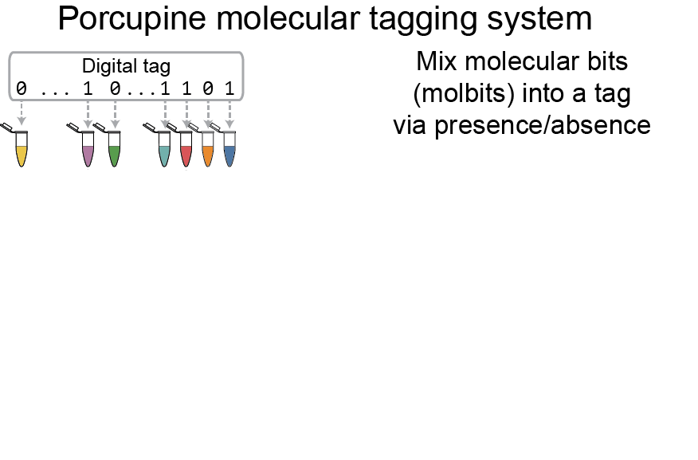

# Porcupine
Porcupine is a molecular tagging system to tag physical objects with DNA.

Preprint available here: https://www.biorxiv.org/content/10.1101/2020.03.06.981514v1

A provisional patent has been filed covering aspects of this work.

# Contents of this repository

1. Designing molbit barcodes
    * `molbit_design`
2. Gathering training/testing data
    * `basecalling` 
    * `data_labeling` 
3. Training & running the classifier
    * `molbit_classification`  
4. Error correction development work
    * `ecc`
5. __All-in-one classification & decoding__
    * `classify_and_decode_basecall_free`
6. Miscellaneous analysis
    * `dehydration_comparisons` -- Comparing fresh & stored tag recovery.
    * `length_comparisons` -- Decoding two different length molbits.
    * `read_count_variance_analysis` -- 
    * `time_to_decode_analysis` -- Evaluating how long it takes to decode a molecular tag.

More details on each of these sections can be found below.

# System requirements

This repository was developed using python 3.6. The functions imported from the various packages are relatively stable and should not be impacted by slight version changes, with the exception of pytorch.

The following python packages are required:
* pytorch 1.1.0, CUDA 10
* seaborn
* matplotlib
* h5py
* pandas
* numpy
* jupyter
* ucrdtw (for sequence design)

Other software:
* Guppy (GPU 3.2.2) -- basecalling
* Scrappie (1.3.2) -- squiggle design
* C and make -- ECC; however, a compiled version of this simple decoder program is included.

When designing molbits, we used the minimum free energy calculations as provided by NUPACK, wrapped as a python library internal to the lab. Unfortunately due to license restrictions, this library cannot be released.

# Installation guide

The bulk of this repository consists of jupyter notebooks. Installing this repository after downloading it requires running a jupyter notebook server with the listed packages installed. A GPU is highly recommended.

# Demo & instructions

For a typical tagging experiment (actual tag contents unknown), run the [all-in-one classification & decoding](https://github.com/uwmisl/Porcupine/blob/master/classify_and_decode_basecall_free/classify_and_decode.ipynb).

To do this, start a jupyter notebook server. Replace file locations at the top of `classify_and_decode.ipynb` with the location of the fast5 reads and the desired output directory (for memoized files). If running this from within the directory structure of the repository, all other file references (e.g., to the saved trained model) can be left alone.

Run the notebook and the decoded tag will be at the bottom of the file. If the actual tag is known, it can be inserted at the bottom of the file for a comparison to the decoded tag.

With a GPU, this takes about 2 mins to run (uses all data, not accumulated over time). On a CPU without parallization active, this takes about 12 mins to run. (~35 min sequencing run, excludes extracting f5 data.)

# Reproduction

All results in the paper can be reproduced with code from the various sections and data from the runs described below. Some visualizations were tweaked in Adobe Illustrator (e.g., font size, annotations, colors) but all raw visualizations are stored in the plots folder.

# Data 

## Sets of molbits

| **Set #** | **#/molbits** | **Description** | **Molbits** |
| --------- | ------------- | --------------- | ----------- |
| 0 | 16 | train | 0, 1, 2, 3, 4, 5, 6, 7, 8, 9, 10, 11, 12, 13, 14, 15 |
| 1 | 16 | train | 16, 17, 18, 19, 20, 21, 22, 23, 24, 25, 26, 27, 28, 29, 30, 31 |
| 2 | 16 | train | 32, 33, 34, 35, 36, 37, 38, 39, 40, 41, 42, 43, 44, 45, 46, 47 |
| 3 | 16 | train | 48, 49, 50, 51, 52, 53, 54, 55, 56, 57, 58, 59, 60, 61, 62, 63 |
| 4 | 16 | train | 64, 65, 66, 67, 68, 69, 70, 71, 72, 73, 74, 75, 76, 77, 78, 79 |
| 5 | 16 | train | 80, 81, 82, 83, 84, 85, 86, 87, 88, 89, 90, 91, 92, 93, 94, 95 |
| 6 | 48 | test | 0, 1, 2, 3, 4, 5, 6, 7, 16, 17, 18, 19, 20, 21, 22, 23, 32, 33, 34, 35, 36, 37, 38, 39, 48, 49, 50, 51, 52, 53, 54, 55, 64, 65, 66, 67, 68, 69, 70, 71, 80, 81, 82, 83, 84, 85, 86, 87 |
| 7 | 48 | test | 8, 9, 10, 11, 12, 13, 14, 15, 24, 25, 26, 27, 28, 29, 30, 31, 40, 41, 42, 43, 44, 45, 46, 47, 56, 57, 58, 59, 60, 61, 62, 63, 72, 73, 74, 75, 76, 77, 78, 79, 88, 89, 90, 91, 92, 93, 94, 95 |
| 8 | 48 | test | 0, 1, 2, 3, 8, 9, 10, 11, 16, 17, 18, 19, 24, 25, 26, 27, 32, 33, 34, 35, 40, 41, 42, 43, 52, 53, 54, 55, 60, 61, 62, 63, 68, 69, 70, 71, 76, 77, 78, 79, 84, 85, 86, 87, 92, 93, 94, 95 |
| 9 | 15 | reorder from IDT | 6, 9, 13, 23, 43, 51, 64, 76, 89, 91, 11, 29, 37, 44, 67 |
| 10 | 52 | MISL tag | 1, 4, 5, 7, 9, 12, 15, 17, 19, 22, 23, 25, 28, 29, 32, 35, 37, 38, 39, 40, 43, 45, 46, 50, 51, 52, 54, 57, 62, 63, 65, 66, 67, 68, 69, 70, 73, 75, 76, 78, 79, 80, 81, 83, 85, 86, 87, 88, 89, 90, 92, 93 |

## What's in each run

| **Run name** | **Molbit set in this run** | **Molbit set(s) previously on this flowcell** | **Description** |
| ------------ | -------------------------- | --------------------------------------------- | -------------- |
| 08_09_2019_run_01 | 0 |  | training data |
| 08_13_2019_run_02 | 1 | 0 | training data |
| 08_13_2019_run_03 | 2 | 0, 1 | training data |
| 08_15_2019_run_02 | 4 |  | training data |
| 08_15_2019_run_03 | 5 | 4 | training data |
| 08_16_2019_run_01 | 3 | 4, 5 | training data |
| 08_28_2019_run_01 | 6 |  | test tag |
| 08_30_2019_run_01 | 7 | 6 | test tag |
| 09_05_2019_run_02 | 8 |  | test tag |
| 09_06_2019_run_01 | 9 | 8 | reorder from IDT (5-5-5 mix) |
| 10_11_19_run_02 | 10 |  | MISL tag |
| 12_16_19_run_01 | 10 |  | dehydrated tag |
| 01_21_20_run_01 | 10 |  | dehydrated tag, 4 weeks |

# Designing molbit barcodes

## molbit_design

Contains the evolutionary model.

Also contains the method used to create sets of molbits that are easier to label when multiplexed (i.e., that are more distinct on average than the full set of 96). This is not the absolute optimally distinct set of sequences, but rather a quick & dirty way to produce sets that are distinct enough to reduce labeling collisions.

# Gathering training/testing data

## basecalling

We basecalled our training data using guppy (GPU version).

## data_labeling

We use sequence alignment to label data.

Through this process, we record the best aligned score, the best molbit, and whether the molbit passed a score filter. This is then used as input to the training process.

# Training & running the classifier

## molbit_classification

Model definition & training:

Predictions on labeled (via sequences) and unlabeled data: molbit_classification_v4

# Error correction & development work

## ecc

See the separate readme for this section.

# All-in-one classification & decoding

## classify_and_decode_basecall_free

End-to-end decoding. Just give it some fast5 files and decode.

# Miscellaneous analysis

## time_to_decode_analysis

To replicate this analysis, you'll need to manually replace the input files in the top of the file. These are all produced by previous steps in the pipeline; however, we managed this input automatically by pulling data from a spreadsheet used to track experiments and their related files. Since it's no fun to have a mystery data structure as input to a function (which you then have to reverse-engineer), I've shown the structure of the inputs in random_sampled_misl_tag_precalculated.ipynb so you can fit this to your own system.
